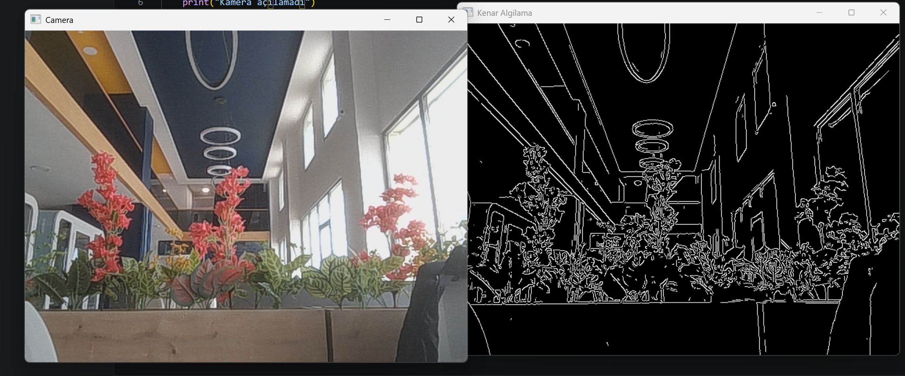

# NavAI - OpenCV Temel Kenar Algılama

Bu proje, NavAI otonom sistemleri için geliştirilen temel bilgisayarlı görü altyapısını içerir.

## Özellikler
- Canny Edge Detection ile anlık kenar takibi.
- Yüksek performanslı görüntü işleme.

## Uygulama Görüntüsü


## Kurulum
```bash
pip install opencv-python